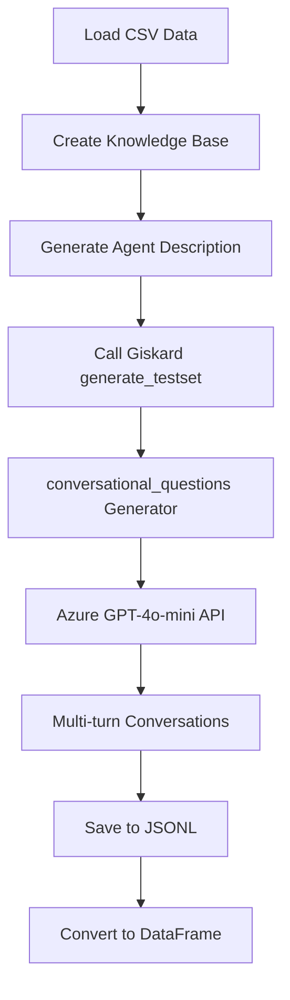

# Conversational Question Generator with Giskard

This repository contains a project that integrates the Giskard library for generating conversational question-answer test sets. The primary objective is to create realistic multi-turn conversations by modifying standalone questions and transforming them into step-by-step exchanges between a user and an assistant.

## 🚀 Features

- **Question Generation**: Uses the Giskard library to generate a dataset of 100 conversational questions based on a knowledge base (in CSV format)
- **Backoff Retries**: Implements retry logic with exponential backoff for API rate-limiting
- **Custom Prompting**: Customization of the `conversational_questions.py` file to modify the way questions are generated and handled
- **Knowledge Base**: Loads a CSV file into a Knowledge Base and uses it to generate relevant questions and answers
- **Azure OpenAI Integration**: Leverages Azure's GPT-4o-mini for question generation and GPTVectorization for embeddings
- **Modular Architecture**: Clean separation of concerns with dedicated classes for configuration, retry handling, and pipeline management

## 📋 Project Structure

```
giskard_dataset/
├── data/
│   └── summaryanswer(in).csv      # Input knowledge base (5,056 technical documentation entries)
├── outputs/
│   └── summary_answer.jsonl       # Generated conversational Q&A pairs
├── scripts/
│   └── g_openai.py                # Main pipeline script
├── trial/                         # Experimental scripts
│   ├── generate_testset.py        # Batch processing approach
│   ├── g.py                       # PDF processing variant
│   └── g_mistral.py               # Mistral model variant
├── venv/                          # Virtual environment
├── requirements.txt               # Python dependencies
├── .gitignore                     # Git ignore rules
└── README.md                      # This file
```

## 🔄 Workflow

The testset generation process follows these steps:

1. **Environment Setup**: Load Azure API credentials and configure Giskard models
2. **Knowledge Base Creation**: Read the CSV file into a pandas DataFrame and convert it into a `KnowledgeBase` object
3. **Question Generation**: Use the modified `conversational_questions` generator to create realistic multi-turn conversations
4. **Error Handling**: Apply retry logic with exponential backoff for API rate limits
5. **Output Processing**: Save the generated testset to JSONL format and convert to DataFrame

### Detailed Process Flow



## 📦 Dependencies

The following libraries are required for the project:

```txt
pandas
python-dotenv
giskard
litellm
```

To install the required dependencies, run:

```shell
pip install -r requirements.txt
```

## ⚙️ Configuration

Create a `.env` file in the project root with your Azure credentials:

```env
AZURE_API_KEY=your_azure_api_key_here
AZURE_API_BASE=your_azure_endpoint_here
```

## 🔧 Modified Giskard Source File

> **⚠️ Important**: This project requires modifications to the core Giskard library.
> 
> **File Modified**:  
> `venv/lib/python3.x/site-packages/giskard/rag/question_generators/conversational_questions.py`

I have modified the **core Giskard source file** to update the system prompt used for generating conversations.

### Changes to `conversational_questions.py`

In the modified version of `conversational_questions.py`, I customized the prompt to generate more engaging and natural conversations by creating structured multi-turn dialogues.

**Original System Prompt** (Before Modification):
```python
CONVERSATIONAL_SYSTEM_PROMPT = """
You are an expert at re-writing questions into natural, realistic, and engaging multi-turn conversations.
Your task is to take a standalone question and reframe it into a believable, step-by-step conversation between a user and an assistant...
"""
```

**Modified System Prompt** (After Modification):
```python
CONVERSATIONAL_SYSTEM_PROMPT = """
You are an expert at re-writing questions into natural, realistic, and engaging multi-turn conversations.

Your task is to take a standalone question and reframe it into a believable, step-by-step conversation between a user and an assistant. This conversation should feel organic, as if it occurred in real life, and must end with a complete and informative assistant response to the original question.

Choose the most suitable structure from the following realistic conversation flows:

1. **Standard Conversation Flow**
   - User introduces the topic vaguely, casually, or with curiosity (no direct question).
   - Assistant responds thoughtfully to encourage discussion.
   - User builds on it and asks the full question.
   - Assistant gives a thorough and helpful answer.

2. **Follow-up with History**
   - User asks a clear question.
   - Assistant provides a full, thoughtful answer.
   - User follows up with a related clarification or historical context.
   - Assistant responds briefly and adds value.

3. **Assistant Asks for Clarification**
   - User starts with a vague or partial question.
   - Assistant seeks clarification with curiosity.
   - User explains more.
   - Assistant gives a detailed, final answer.

4. **Incomplete Answer with Follow-up**
   - User asks a direct question.
   - Assistant provides a short or surface-level answer.
   - User digs deeper, asks for clarification or history.
   - Assistant explains further.
   - User ends with a simple related follow-up.
   - Assistant wraps it up with clarity.
"""
```

## 💻 Running the Code

### Main Pipeline

To generate conversational questions using the main pipeline:

```shell
cd scripts
python g_openai.py
```

This will:
- Load the knowledge base from `../data/summaryanswer(in).csv`
- Generate 100 conversational question-answer pairs
- Save them to `summary_answer_1.jsonl`
- Display a preview of the generated data

### Batch Processing (Alternative)

For processing large datasets in batches:

```shell
cd trial
python generate_testset.py
```

This approach processes data in smaller batches of 10 documents, generating 10 questions per batch with 10-second delays between batches.

## 📊 Output Format

The generated testset contains conversational Q&A pairs in JSONL format. Each entry includes:

```json
{
  "id": "unique-uuid",
  "question": "What is the first step to configure...",
  "reference_answer": "The first step is to...",
  "reference_context": "Document content...",
  "conversation_history": [
    {
      "role": "user",
      "content": "I'm trying to set up..."
    },
    {
      "role": "assistant", 
      "content": "That sounds like a useful project..."
    }
  ],
  "metadata": {
    "question_type": "conversational",
    "seed_document_id": 123,
    "topic": "Technical Configuration"
  }
}
```

## 🔄 Supported Conversation Flows

1. **Standard Flow**: Curiosity → Assistant responds → Clear question → Full answer
2. **Follow-up with History**: Q&A → Follow-up context → Additional assistant value  
3. **Clarification Request**: Vague question → Clarify → Explain → Full answer
4. **Incomplete → Deep Dive**: Short answer → User digs deeper → Final wrap-up

## 🎯 Ideal Use Cases

- **Evaluating LLM reasoning in multi-turn interactions**
- **Training dialogue systems for technical support**
- **Dataset generation for conversational AI tasks**
- **RAG system evaluation with realistic user queries**
- **Creating test scenarios for customer support chatbots**

## 🛠️ Technical Architecture

### Key Components

- **ConfigManager**: Handles environment setup and Azure API configuration
- **RetryHandler**: Implements exponential backoff for API rate limiting
- **KnowledgeBaseManager**: Creates knowledge bases and generates testsets
- **TestsetManager**: Handles saving/loading of generated testsets
- **RAGPipeline**: Orchestrates the entire process

### Error Handling

The system includes robust error handling:
- Exponential backoff for rate limit errors
- Maximum of 5 retry attempts
- Random jitter to prevent thundering herd problems
- Graceful failure handling with informative error messages

## 📈 Performance Considerations

- **Rate Limiting**: Built-in retry logic handles Azure API rate limits
- **Memory Management**: Batch processing option for large datasets
- **Error Recovery**: Automatic retry with exponential backoff
- **Monitoring**: Progress tracking and batch status reporting

## 🤝 Contributing

1. Fork the repository
2. Create a feature branch
3. Make your changes
4. Test with a small dataset
5. Submit a pull request

## 🙏 Acknowledgments

- Built on top of the [Giskard](https://github.com/Giskard-AI/giskard) library
- Uses Azure OpenAI for question generation
- Inspired by real-world technical support scenarios
